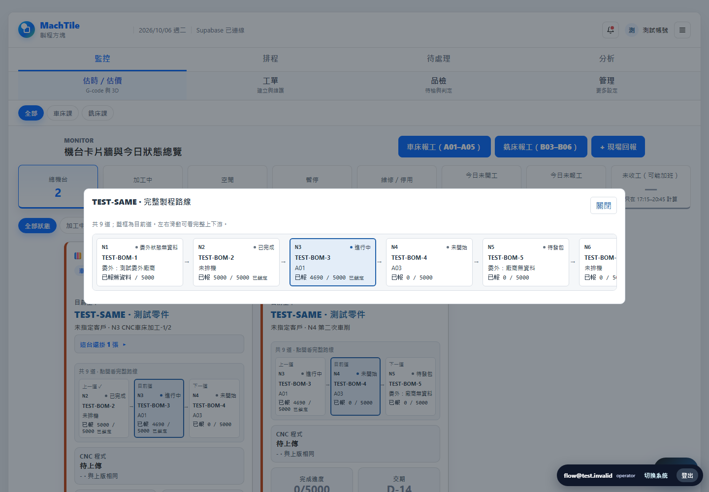
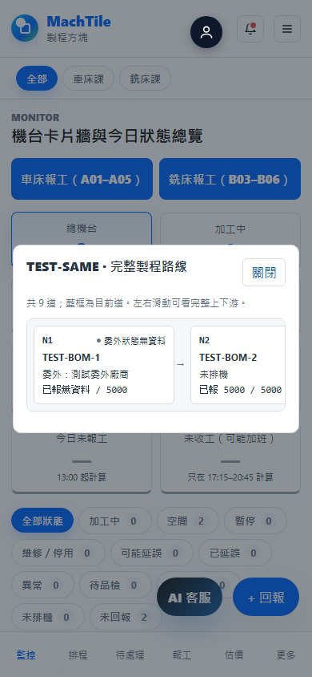

# 完整路線＋委外工序顯示（PR only）

## 相依與範圍

上線順序：#93/#94/#96 → mini-mes #97（正式化 #64 同格式設定表＋路線 SQL）→
SoftNet #770（派工橋＋owner 本機安裝器）→ 本 APP PR。APP 已整合 #64 head
8535956996de3ab669a641216626fe9f998a5a3e，保留 quantityLabel()/visibilityLevel()。
#64 尚未合入 main 時本 PR 包含它的既有 diff；請先合 #64 再審本包新增 diff。
本 PR 沒有另起設定格式，也不把 production 中 #64 SQL 草稿當作另一份建表腳本套用。
SQL／正式DB套用、PR合併與部署都要 owner 另行核准，這次沒執行。

新增 GET work_order_route_steps，50 張工單一批、回應最多 12800 列（50×256）、
超限／非陣列／重複步序／跨工單資料失敗就退回原工序，不保留上次的路線 metadata。
原工序來源失敗仍沿用既有「未驗證」提示，不能拿 BOM 推算報工數或機台。

#770 審查後，同步讀 `station_codes` 與 `is_confirmed`：共用站如 B03–B06
全部以「對應機台」列出；未發行 BOM 仍可顯示，但每道明確標「BOM 未發行」。
這兩欄只作顯示，不給機台操作權，也不改流程狀態或已報數。

每格：BOM 工序名＋N步序；廠內以 process_order 對現有 work_order_processes，
保留 ID、status、原 cardProgress 已報快照、機台與改派 audit；委外顯示
「委外：廠商名」（缺名退實際廠商代號，皆缺則無資料），不具備機台或预排控制。
只有 metadata 的道顯示已報／狀態／機台無資料，不假稱已發包、委外中或已完成。
若原工序真有狀態／已報，保留真值。委外不新增到可派工工序。
卡片、完整路線 dialog、排程卡片和工單管理都用同一 mergeRoute()；管理頁
步序選單仍只有實際工序，沒有把 BOM metadata 變成可更新／可報工的 process_id。
不新增 POST 或變更既有派工／預排／報工 payload；app.js/processFlowCore cache bump。

## owner 已接受的資料層取捨

#97 RLS 錨點是使用者課別內機台上所有未完成工序，前後／下一道取聯集。
同單跨兩台同課機台，可讀範圍可能比單張卡片三格更多，這是核准的取捨。
跨課機台不能當額外錨點；相鄰路線 metadata 的站名／委外名稱不是機台操作權。
管理員／主管／生管 full、設定表缺失／讀不到 full；RLS 仍先驗身分與租戶。
APP 使用 #64 visibilityLevel() 控制卡片，資料庫只回該角色允許的新路線 metadata。
既有 work_order_processes 本來可讀的資訊仍受 #94，不宣稱新 RLS 能撤回那份資訊。
瀏覽器設定 GET 失敗≠DB 設定 reader 失敗；前端 full fallback 不能越過 SQL RLS。

## 驗證與重跑

Node syntax：`node --check app.js`、`node --check processFlowCore.js`。
核心 `node processFlowCore.test.js`：70/70 PASS；另 12 支既有非 browser 測試先前 PASS。
設 `MACHTILE_PLAYWRIGHT_MODULE` 指向筆電既有 playwright/index.mjs，逐支執行
`node <檔名>.browser.test.mjs`，使用 localhost 靜態伺服器＋攔截的假後端。
只有假資料 TEST-SAME／TEST-BOM／測試廠商，沒有正式帳號、單號或庫存數字。
全套 19 支 browser 結果如下（沒有資料庫或正式網域呼叫）：

| 測試 | 結果 |
|---|---|
| analytics | 92 PASS |
| batchModes | 74 PASS |
| batchReport | 60 PASS |
| cardEstimate | 59 PASS |
| cardOverQty | 37 PASS |
| cardPick | 77 PASS |
| cardTidy | 67 PASS |
| firstArticle | 40 PASS |
| fullRoute | 45 PASS |
| machineDepartments | 106 PASS |
| monitorEntry | 42 PASS |
| navTrim | 79 PASS |
| oauthHandoff | 41 PASS |
| processFlowVisibility | 33 PASS |
| reviewFix | 11 PASS |
| todayTiles | 76 PASS |
| tvWall | 75 PASS |
| workOrderProcess | 99 PASS |
| workOrders | 91 PASS |

fullRoute 45 項包含每次路線 GET 必帶最多 50 張單的 `work_order_no=in.(...)` 篩選、
9 道（7+）、已完成、同張卡片 4690 的快照一致、委外廠商／
缺狀態、不具備機台控制、1440/390、條內橫捲但整頁不溢出、hidden/next_only、
503／缺表／重複路線退回原工序；缺表 404/PGRST205 在本次登入快取，
同次登入的刷新、整頁重載與管理頁不再重試或重複警告，同帳號重新登入才恢復查詢；管理選單僅原工序、排程卡片、
adjacent 加路線資料仍只顯示前後道；BOM-only 委外上游不阻擋實際下一道預排，
0 JS errors／0 upsert／只呼叫既有唯讀 RPC／無正式網域。

合成畫面（不是影子／正式單据）：

## 負面驗證、限制與回復

沒有 DB/ERP/工廠/ai_ro/192.168.1.210/Supabase 正式連線，沒有 migration 套用。
沒改卡片選單、department gate、既有報工／今日品檢邏輯、三把機密、控制面或舊 MES。
工作紀錄、真實資料、全部其它輸出／logs 留本機，不進 PR。
SQL 的非 superuser 證據在 #97，橋接故障回復在 #770；本測試假 API 不等同正式
PostgREST RLS 或工廠驗收，需獨立 L3＋owner 上線 smoke。
這包尚未部署：不合併即可保留原行為。部署後由 owner 回前個 APP 靜態版本，
先停新橋同步，再照 #770 備份還原，SQL 表可保留或依 #97 export/RESTRICT 回滾。
