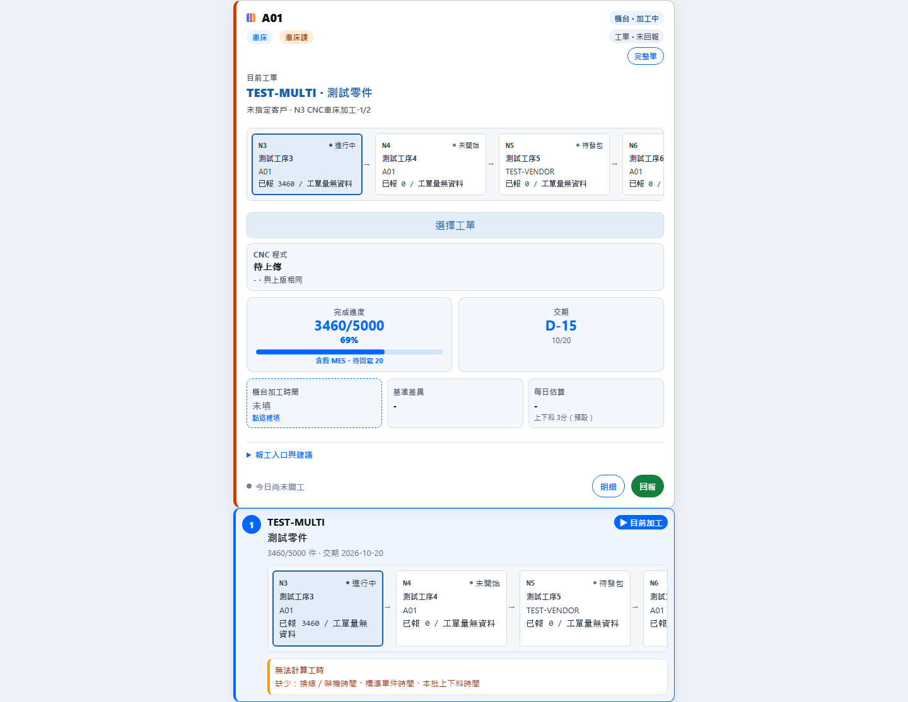
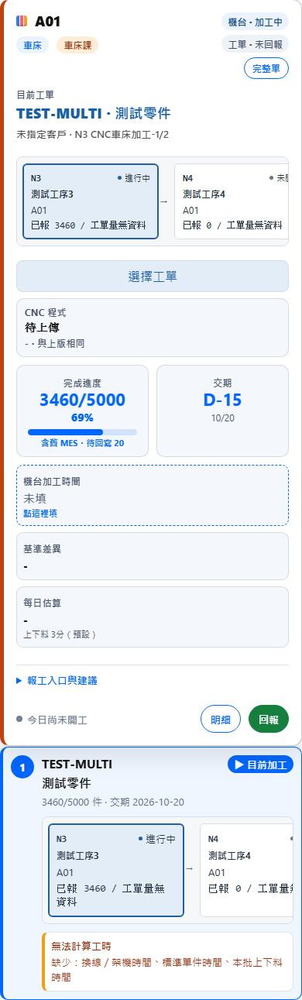
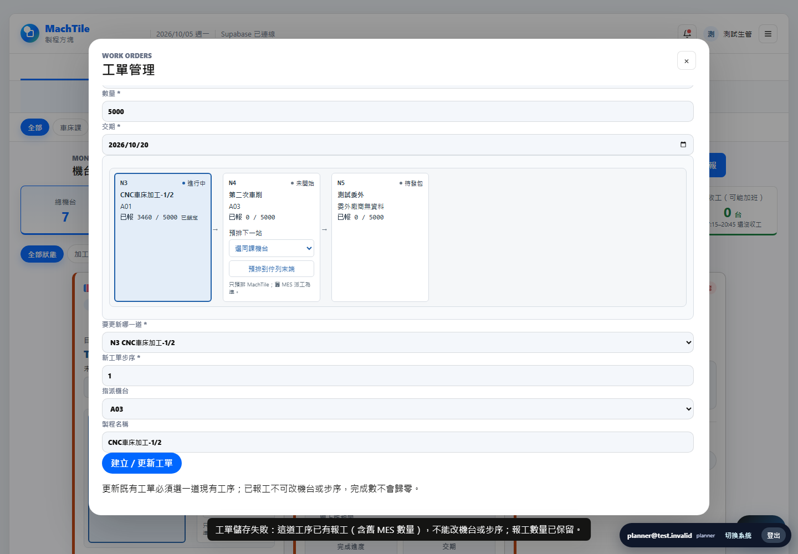
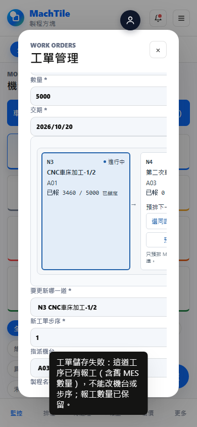
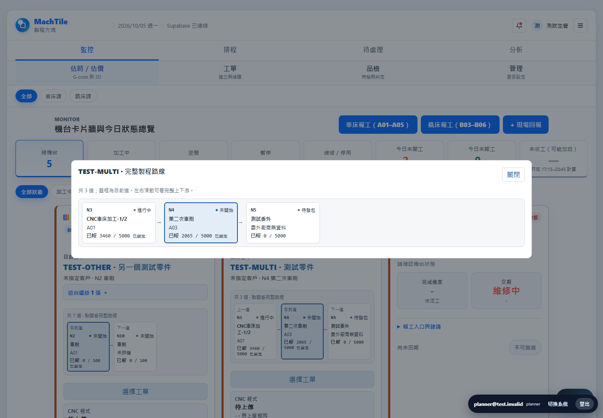
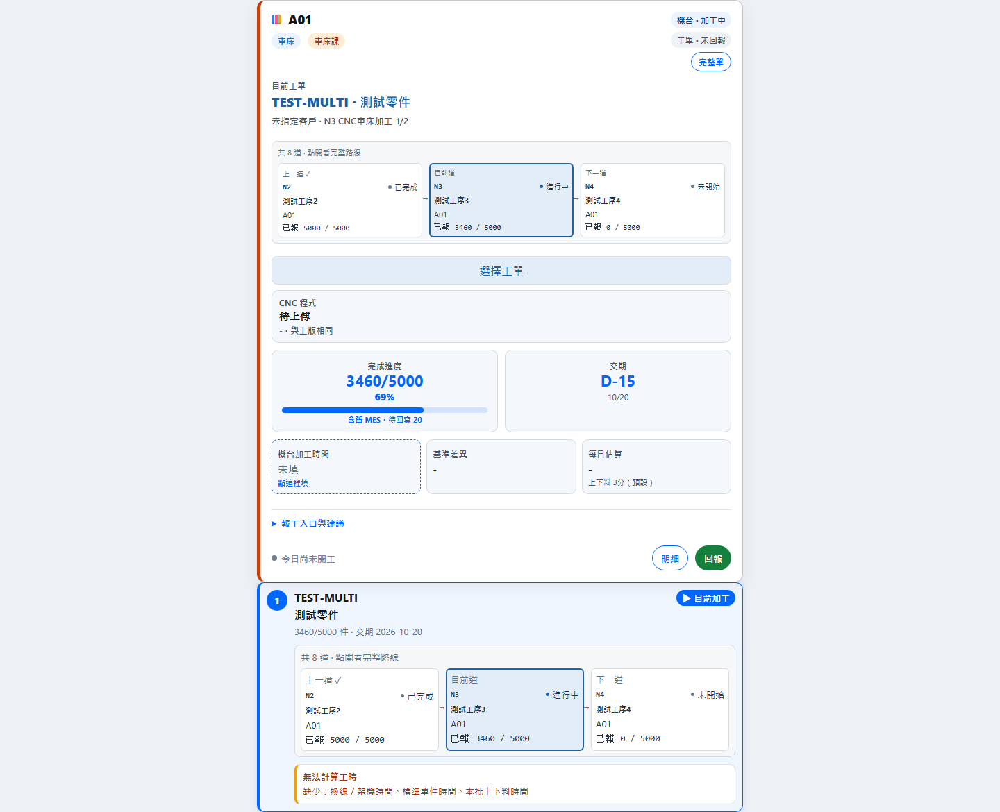
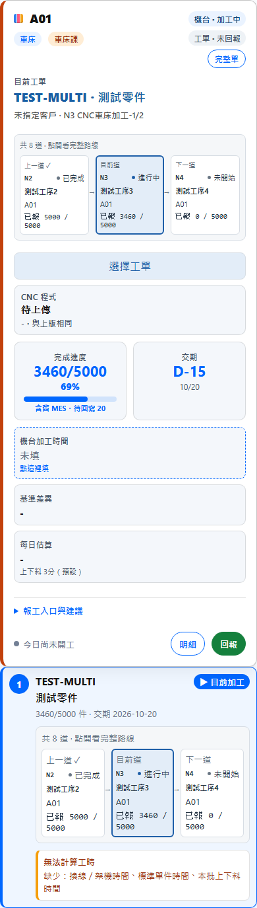
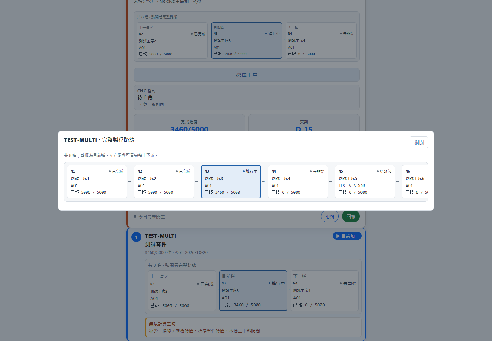
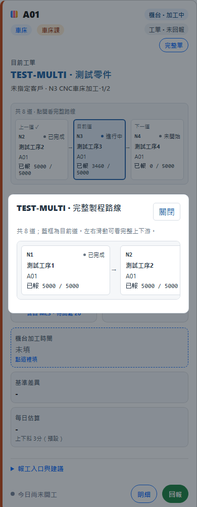

# 共用製程流程條（A 前端；PR only）

依賴／上線順序：#92 migration → mini-mes #93 migration → 本 PR 前端。先合 #60（本分支基底）及 SoftNet #768 派工工序名後上線；本次不合併、不部署、不套庫。main 有分支保護，本 PR 只推功能分支。

套用機台卡片、工單管理現有製程清單、排程板卡片。processFlowCore.js 同一 renderer：真實 process_order／process_name、machine_code（缺少委外廠商資料明示「委外廠商無資料」，不以名稱猜代號）、狀態、batch_report_progress 含舊 MES＋待回寫的已報量／工單量。current 用 process ID 或唯一 running；多個 running 不猜。路線缺漏不補假工序，查詢失敗不顯示假 0。卡片只顯示上一道／目前道／下一道三格與「共 N 道」，完成勾號只根據真正 completed。點流程條或一般左鍵「完整單」開完整路線，從 N1 開始、目前道藍框；手機長路線只在對話框內橫向捲動。工單管理仍保留全路線與預排操作。完整單 Ctrl／中鍵仍保留既有網址導覽行為。

同課下一道可選可用機台並呼叫 #93 machine_queue_append，一次原子追加尾端、不重送整台 queue。App 不寫舊 MES，已報工／委外／課別不明／維修停用不能預排；伺服器再次檢查（前端只是提示）。progress 或 audit 讀取失敗時不提供預排操作。既有 machine_queue_reorder「選目前工單」功能不變。

client request UUID 在網路結果不確定時保留；雙擊一筆 in-flight，同 UUID 重送交給 server idempotency；成功後重新讀路線及 queue。若 server 成功但畫面更新失敗，明示「已預排」並停用重送按鈕。process_assignment_events 僅讀，實際 legacy_reassigned 才顯示「已依舊 MES 改派」；未確認不假報改派。

## 驗證（全假資料，本機瀏覽器）

```powershell
node processFlowCore.test.js
node --check app.js
$env:MACHTILE_PLAYWRIGHT_MODULE='D:\Codex\MachTile\.test-deps-hmc-20260913\node_modules\playwright\index.mjs'
node workOrderProcess.browser.test.mjs
```

本輪最新：Core 38/38；實際 index.html/app.js + 假 API 的 browser 85/85；workOrders 91/91、cardPick 77/77。含真實 view 欄位形狀 machine_id（不是 id）、N4=A03 且舊 MES 已報 2065、8 道、委外、已完成、1440/390、三格預覽不需橫捲、完整路線內捲不溢出、Enter／Escape／焦點回復、登出清除路線快取。預排只在展開完整路線或管理頁內，原 RPC／payload 不變；同課選項、reported 拒絕、雙擊／重試、順序不歸零、legacy override、audit 缺表 fail-closed 均通過。送出前 context 失敗保留完整路線表單且不送 RPC。fake HTTP 的寫入僅 Playwright route.fulfill；沒有連任何真實 Supabase 或 DB。

index 的 app.js/styles.css ?v 已 bump，新增 core 在 app.js 前載入。既有首件檢查／今日品檢打卡／報工 payload／舊 MES 回寫沒有改動。

### #61 基線假資料截圖（以下四張為已合 main 原件）






### 任務 3 最新假資料截圖







根因證據：owner 已匯出的 q03 catalog 定義中，v_machine_management_cards 明確是 `m.id AS machine_id`；舊 normalizeMachineMaster 只讀 `row.id`，其 Map key 空白，不能匹配每道的 machine_id。先將 browser fixture 改為 view 真實欄位，原碼重現 N4 assertion failure，再修成 `row.machine_id || row.id`；原始 machines 表 id 形狀仍支援。這不是 RLS 放寬，不新增查詢／RPC／migration，也沒有改 v_work_order_cards 語意。

整合 main：已 fetch，MERGE_HEAD 為 c5cc6bd29ce1f8e0d534011b406b2ddf0cbb77bf（含 #60／#61）。不改寫歷史。index script/cache 衝突保留 core 並更新版本；stash 恢復的六檔衝突保留已驗證的課別守衛、POST 失敗保留狀態、真實機台課別後備及測試，不還原舊 machine_type 後備。正式 snapshot／真實工單號不進 PR。

## 限制／回滾

目前 MachTile 既有工序表沒有橋接委外廠商代號來源；只能對已提供 supplier_code 的資料顯示代號，正常讀取缺少時明示無資料。#93 已套用並凍結，本 PR 不修改 SQL。#62 課別前端須等修正後 #94 SQL 套用才可合／上線。完整路線只取既有列，不承諾未同步的後續工序；交辦檔任務 1「一單多道派在不同機台的卡片來源」及任務 2 Factory BomView 不屬本輪任務 3，沒有修改那兩個資料來源。

本 PR 未合併／部署，無正式資料須回復；若日後上線需回退，回到本 PR 整合的 main c5cc6bd29ce1f8e0d534011b406b2ddf0cbb77bf 前端資產。資料庫回滾不在本任務授權內，需另由 owner 決定；#93 已安裝的原 migration 保持凍結。
